# 📚 Czyszczenie danych: zwierzęta

## 🎯 Wprowadzenie

Dane zostały wygenerowane maszynowo. Zawierają około 1 000 wierszy na temat zwierząt zauważonych w rejonie środkowo-wschodnim Europy w 2024 roku. Zostały pobrane ze strony _[Kaggle.com](https://www.kaggle.com/datasets/joannanplkrk/dirty-data-to-clean-whats-wrong-with-this-dataset/data)_.

Do czyszczenia danych zostało wykorzystane Power Query oraz M-Language.


W danych znajduje się 11 kolumn 1011 wierszy oraz 4 błędy.


## ⚙️ Proces

W zestawie danych znajduje się wiele wartości null, jedna kolumna jest całkowicie pusta, występują także błędne formaty, które generują błędy.

1. **Usunięcie duplikatów**

   W pierwszej kolejności w edytorze Power Query zostały nadane pierwsze wiersze jako nagłówki kolumn, następnie za pomocą interfejsu usunięto powtarzające się wiersze danych.

2. **Usunięcie kolumny**

   Kolumna "Animal code" jest całkowicie pusta - nie zawiera żadnych danych, dlatego została usunięta.

   
   

3. **Standaryzacja nagłówków**

   Nagłówki kolumn są napisane w różnych formach, dlatego aby je ujednolicić i zwiększyć przejrzystość postanowiłam wykorzystać format notacji wężowej z wielką literą na początku.

   ```
   #"Zmiana formatu nagłówków" = Table.TransformColumnNames(#"Usunięto kolumny", each
                                                               let
                                                               ZastapSpacje = Text.Replace(_, " ", "_"),
                                                               MaleLitery = Text.Lower(ZastapSpacje),
                                                               Wynik = Text.Upper(Text.At(MaleLitery, 0)) & Text.Range(MaleLitery, 1)
                                                               in
                                                               Wynik
                                                               ),
   ```

4. **Usunięcie pustych wierszy**

   W całym zestawie danych brakuje wiele wartości. Jest aż 19 wierszy, w których nie ma wartości dotyczących typu zwierzęcia.</br>
   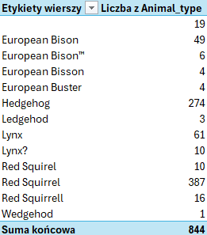</br>
   Aż 11 wierszy zawiera jedynie datę obserwacji i osobę, która te dane zebrała, nic z tymi danymi nie da się zrobić, dlatego zostały one usunięte. 8 wierszy nie zawiera jedynie współrzędnych geograficznych, dlatego postanowiłam je zostawić, być moze uda się je uzupełnić.</br>
   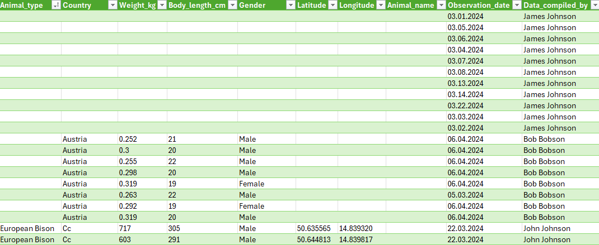

5. **Standaryzacja danych**
   - We wszystkich danych zastosowano wielką literę na początku każdego wyrazu, usunięto niepotrzebne spacje i znaki niedrukowalne, wracając do punkty 4. można jednak zauważyć, że w nazwach występują znaki specjalne - do usunięcia użyto funkcji języka M.

     ```
     #"Usunięcie znaków specjalnych" = Table.TransformColumns(#"Usunięto pierwsze wiersze", {"Animal_type", each Text.Select(_, {"a".."z", "A".."Z", " "})})
     ```

   - Ponadto w danych znajduje się wiele literówek. W celu pozbycia się ich stworzyłam słowniczek, który przypisuje wszystkim zaistniałym literówkom odpowiednie wartości.</br>
     Następnie za pomocą funkcji "Scal zapytania" oraz dopasowania rozmytego zmienione zostały błędne wartości.</br>
     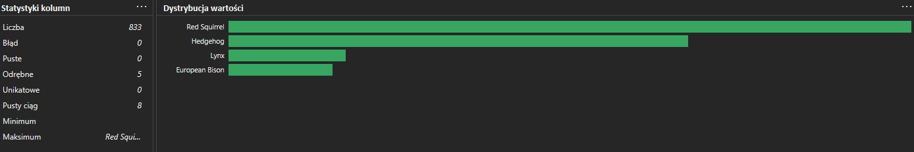

   - W przypadku państw pierw trzeba się zastanowić nad występowaniem Australii (4 wystąpienia), ponieważ dane pochodzą z środkowo-wschodniej Europy, więc nie wiadomo czy te dane nadają się do tego zestawu danych czy też zdarzyła się dość częsta pomyłka z przypisaniem Australii zamiast Austrii. Na szczęście we wszystkich przypadkach są podane współrzędne geograficzne, więc po sprawdzeniu okazało się, że to Austria.</br>
     </br>
     Podobny problem pojawił się przy skrócie "Cc", który oznacza Wyspy Kokosowe należące do Australii, ale w tym przypadku również podane zostały współrzędne geograficzne, więc została im przypisana Republika Czeska.</br>
     

   - Przystosowanie danych do polskiego formatu. Zmiana typów danych na odpowiednie formaty.

   - W przypadku płci dla pustych kolumn zastosowano przypis "Not determined", który już istnieje w danych.

6. **Uzupełnienie brakujących wartości**

   Przyglądając się danym, w szczególności wadze i długości ciała, można stwierdzić, że obserwowane zwierzęta to wiewiórki. Wszystkie dane z brakującymi nazwami zwierząt wprowadził pracownik "Bob Bobson". W celu uniknięcia błędów i niepoprawnych statystyk dane te można by było usunąć, jednak przyjęłam, że mam możliwość skontaktowania się z tą osobą, która potwierdziła, że są to wiewiórki.</br>
   Uzupełniłam brakujące nazwy.</br>
   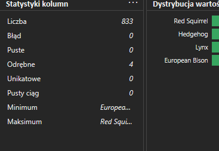

7. **Analiza poprawności danych**

   Wszystkie dane liczbowe zostały sprawdzone pod kątem poprawności. Z opisu danych wynika, że dane wprowadzali ludzie - pracownicy, więc możliwe, że wkradły się błędy. W tym celu otworzone odpowiednie miary w tabelach przestawnych.

- Rysie</br>
  - Waga</br>
     </br>
    Jedna wartość znacznie wyróżnia się od innych, wynosi aż 171kg, podczas gdy mediana wagi rysi wynosi 22kg - jest to ewidentny błąd. W związku z tym, że date nie muszą spełniać surowych norm postanowiłam zamienić tę wartość na medianę. Osobnik, przy którym pojawił się błąd, był samcem, ale tak się składam, że mediana dla obu płci wynosi 22kg.

  - Długość ciała</br>
    W przypadku długości ciała nie zauważono żadnych anomalii.</br></br>
    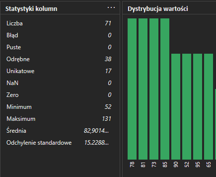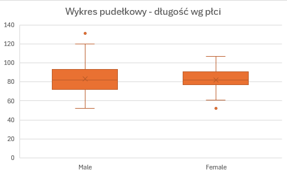 </br>
    Widać dwa odchyły długości odstające od grupy, są to wartości: 131cm dla samców oraz 52cm dla samic. Wartości je jednak są całkowicie w normie przy większych okazach samców i mniejszych samic, dlatego uznaje się je za poprawne.</br></br>

- Bizony Europejskie</br>
  - Waga</br>
    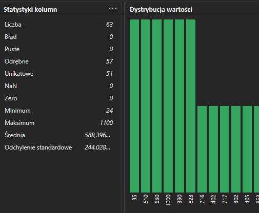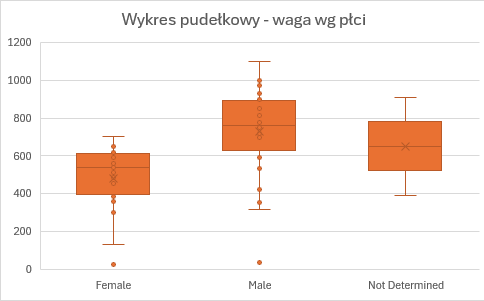 </br>
    Na wykresach oraz na odchyleniu standardowym widać, że jest kilka skrajnych wartości. Są one bardzo niskie, dlatego postanowiłam przeanalizować je w tabeli z danymi porównując inne czynniki. Jak można zauważyć w tabeli poniżej osobniki z najmniejszymi wagami mają również najmniejsze długości ciała, co może oznaczać, że są to prawdopodobnie bardzo młode osobniki, dlatego dane pozostawiłam bez zmian.
    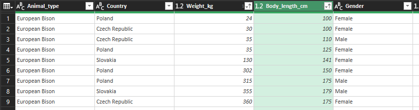</br></br>

  - Długość ciała</br>
    W przypadku długości osobników występuje podobny rozkład jak przy wadze. Pojawiają się wartości skrajnie małe, ale porównując je z wagą okazuje się, że to te same osobniki, dlatego pozostawiono dane bez zmian.
    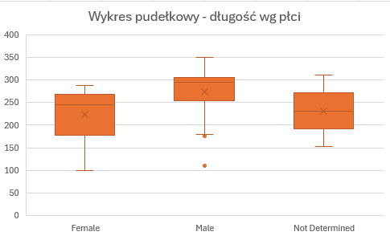</br>

- Wiewiórki pospolite
  - Waga</br>
    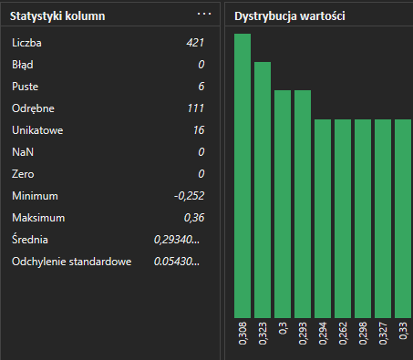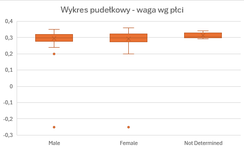 </br>
    W danych widać wartości ujemnie, które są ewidentnymi błędami. Po dokładnym przyjrzeniu się danym można wywnioskować, że osoba wprowadzająca wartości przez przypadek postawiła znak ujemny, dlatego usunięto wartości ujemne i dane nie będą odstawać od pozostałych.
    Po zmianie wartości pozostało jeszcze jedno odchylenie dla samców wynoszące 0,2kg. Porównując te dane do długości ciała, która wynosi 14cm, i równocześnie jest najmniejszym wynikiem w grupie, można uznać, że badany osobnik jest młodą wiewiórką, dlatego pozostawiono dane bez zmian.</br>

  - Długość ciała</br>
    Podobnie jak w przypadku wagi pojawiły się wartości ujemne, które zamieniłam na dodatnie.
    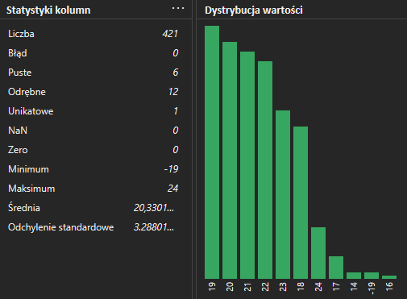</br>
    Ponadto widać także puste komórki.

  W przypadku wagi i długości ciała pojawiło się 6 pustych komórek. Po przyjrzeniu się tym danym, okazuje się, że wszystkie należą do tych samych rekordów. W związku, że różnice pomiędzy osobnikami poszczególnych płci są tak naprawdę bardzo mało, postawiłam uzupełnić te dane medianami wag i długości ciała dla poszczególnych płci. Mediana wagi dla obu płci wynosi 0,3kg natomiast długość ciała dla samic to 20cm, a dla samców 21cm.

```
    #"Zmiana wagi ""null"" dla wiewiórek" = Table.ReplaceValue(#"Wartości nieujemne",
                                                                each [Weight_kg],
                                                                each if [Animal_type] = "Red Squirrel" and [Weight_kg] = null  then 0.3 else [Weight_kg],
                                                                Replacer.ReplaceValue,
                                                                {"Weight_kg"}),
```

</br>

- Jeże
  - Waga</br></br>
    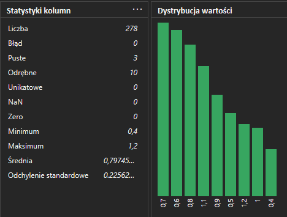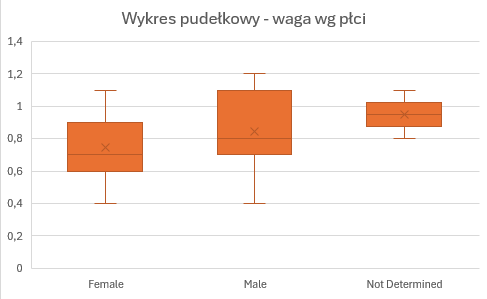</br>
    W przypadku wagi nie widać żadnych wartości odstających. Pojawiły się natomiast pusta wartości, które także uzupełniono o mediany dla poszczególnych płci: samice - 0,7kg, samce - 0,8kg.

  - Długość</br>
    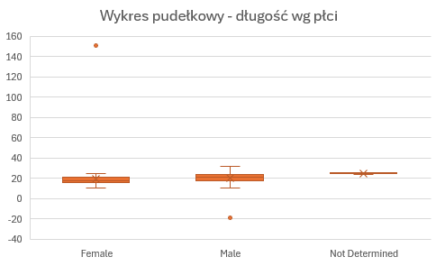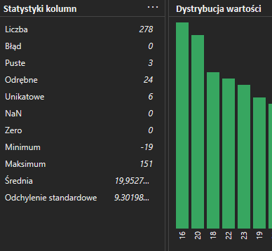</br>
    Wartość ujemna została zmieniona na dodatnią - po przeanalizowaniu danych okazuje się, że jest to po prostu błąd, podobnie jak w przypadku samicy, której długość osiągnęła aż 151cm. Tak jak poprzednio błędy zostają zamienione na mediany: samice - 18cm, samce 21cm.

- Współrzędne geograficzne</br>
  Aż 81 rekordów jest pustych, co stanowi ponad 10% całości.</br>
  Obserwacje były prowadzone w Europie, więc wszystkie współrzędne powinny być dodatnie, pokazuje się jednak, że dla szerokości geograficznej pojawiły się jako ujemne.</br>
  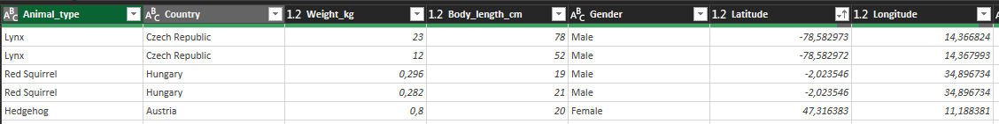</br>
  Nie wiadomo jak dokładnie jak wprowadzana lokalizacja, czy pracownicy wprowadzają ją ręcznie czy używany jest do tego lokalizator, jednak porównując te dane z innymi przedstawicielami swoich gatunków, są one całkowicie różne. W tym przypadku postanowiłam przy nieprawidłowych wartościach wpisać wartości "null".

```
    #"Szerokość i długość geograficzna" = Table.ReplaceValue(#"Zmieniono typ1",
                                                                each [Latitude],
                                                                null,
                                                                (currentValue, baseValue, replaceValue) => if baseValue <> null and baseValue < 0 then null else currentValue, {"Latitude", "Longitude"}),
```

- Daty</br>
  Wczytując się w początkową notatkę danych, okazuje się, że jest osoba, która używa amerykańskiego formatu danych i rzeczywiście można to zauważyć, gdyż z ustaleń zestawu danych wynika, że obserwacja zwierząt miała miejsca od marca do czerwca 2024r. a dane Jamesa Johnsona po zostawieniu w formie jakiej są pokazałyby miesiące takie jak lipiec, wrzesień czy nawet listopad.
  Do naprawy stworzono kolumnę niestandardową z kodem:

  ```
  =if [Data_compiled_by] = "James Johnson"
  then Date.From([Observation_date], "en-US")
  else Date.From([Observation_date], "pl-PL")
  ```

- Imiona zwierząt</br>
  Ostatnią częścią jest podanie imion zwierząt. 795 rekordów nie ma w ogóle imienia oraz Bob Bobson nazwał 18 osobników swoim imieniem i nazwiskiem. Wartości te postanowiłam zamienić na "Not Determined".

## 💡 Konkluzja

Po wyczyszczeniu danych pozostało 833 rekordów, co stanowi ok. 82% pierwotnych danych. Pomimo skrupulatnego czyszczenia niektóre wartości pozostawiłam puste ze względu na wartość innych danych w poszczególnych rekordach.</br>
W niepoprawności danych główną przyczyną błędów byli ludzie, którzy robili literówki, zapominali o wpisaniu danych lub mylili się (chociażby wpisanie błędnych współrzędnych). Dane te zostały naprawione przy drobnych błędach jak literówka czy dodanie znaku "-", gdzie nie był on potrzebny, w przypadku braku danych lub wartości odstających zastosowano estymacje.</br>
W przyszłości zalecane byłoby wprowadzenie walidacji danych, jak chociażby ujednolicenie systemu dat lub automatycznie pobieranie daty podczas wypełniania danych, podobnie jak zastosowanie lokalizacji, aby nie powstawały błędy przy współrzędnych.
