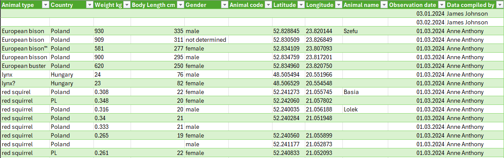
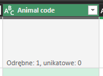
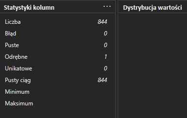
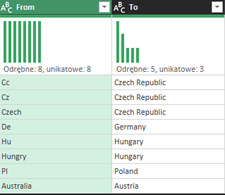
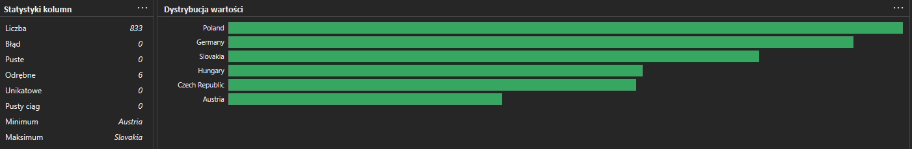
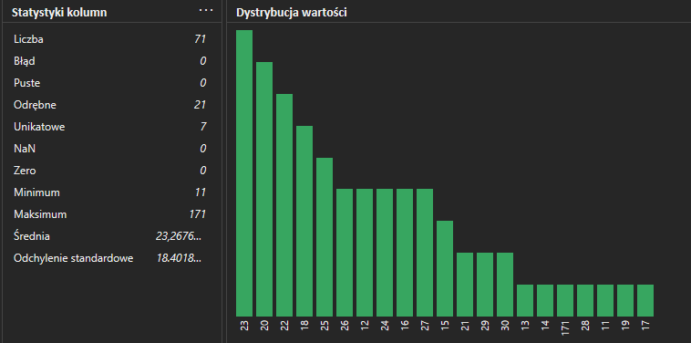
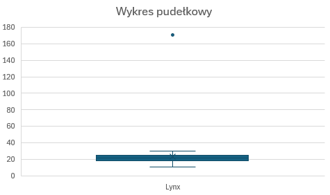

# 📚 Czyszczenie danych: zwierzęta

## 🎯 Wprowadzenie

Dane zostały wygenerowane maszynowo. Zawierają około 1 000 wierszy na temat zwierząt zauważonych w rejonie środkowo-wschodnim Europy w 2024 roku. Zostały pobrane ze strony _[Kaggle.com](https://www.kaggle.com/datasets/joannanplkrk/dirty-data-to-clean-whats-wrong-with-this-dataset/data)_.

Do czyszczenia danych zostało wykorzystane Power Query oraz M-Language.



W danych znajduje się 11 kolumn 1011 wierszy oraz 4 błędy.


## ⚙️ Proces

W zestawie danych znajduje się wiele wartości null, jedna kolumna jest całkowicie pusta, występują także błędne formaty, które generują błędy.

1. **Usunięcie duplikatów**

   W pierwszej kolejności w edytorze Power Query zostały nadane pierwsze wiersze jako nagłówki kolumn, następnie za pomocą interfejsu usunięto powtarzające się wiersze danych.

2. **Usunięcie kolumny**

   Kolumna "Animal code" jest całkowicie pusta - nie zawiera żadnych danych, dlatego została usunięta.

   
   

3. **Standaryzacja nagłówków**

   Nagłówki kolumn są napisane w różnych formach, dlatego aby je ujednolicić i zwiększyć przejrzystość postanowiłam wykorzystać format notacji wężowej z wielką literą na początku.

   ```
   #"Zmiana formatu nagłówków" = Table.TransformColumnNames(#"Usunięto kolumny", each
                                                               let
                                                               ZastapSpacje = Text.Replace(_, " ", "_"),
                                                               MaleLitery = Text.Lower(ZastapSpacje),
                                                               Wynik = Text.Upper(Text.At(MaleLitery, 0)) & Text.Range(MaleLitery, 1)
                                                               in
                                                               Wynik
                                                               ),
   ```

4. **Usunięcie pustych wierszy**

   W całym zestawie danych brakuje wiele wartości. Jest aż 19 wierszy, w których nie ma wartości dotyczących typu zwierzęcia.</br>
   </br>
   Aż 11 wierszy zawiera jedynie datę obserwacji i osobę, która te dane zebrała, nic z tymi danymi nie da się zrobić, dlatego zostały one usunięte. 8 wierszy nie zawiera jedynie współrzędnych geograficznych, dlatego postanowiłam je zostawić, być moze uda się je uzupełnić.</br>
   

5. **Standaryzacja danych**
   - We wszystkich danych zastosowano wielką literę na początku każdego wyrazu, usunięto niepotrzebne spacje i znaki niedrukowalne, wracając do punkty 4. można jednak zauważyć, że w nazwach występują znaki specjalne - do usunięcia użyto funkcji języka M.

     ```
     #"Usunięcie znaków specjalnych" = Table.TransformColumns(#"Usunięto pierwsze wiersze", {"Animal_type", each Text.Select(_, {"a".."z", "A".."Z", " "})})
     ```

   - Ponadto w danych znajduje się wiele literówek. W celu pozbycia się ich stworzyłam słowniczek, który przypisuje wszystkim zaistniałym literówkom odpowiednie wartości.</br>
     Następnie za pomocą funkcji "Scal zapytania" oraz dopasowania rozmytego zmienione zostały błędne wartości.</br>
     

   - W przypadku państw pierw trzeba się zastanowić nad występowaniem Australii (4 wystąpienia), ponieważ dane pochodzą z środkowo-wschodniej Europy, więc nie wiadomo czy te dane nadają się do tego zestawu danych czy też zdarzyła się dość częsta pomyłka z przypisaniem Australii zamiast Austrii. Na szczęście we wszystkich przypadkach są podane współrzędne geograficzne, więc po sprawdzeniu okazało się, że to Austria.</br>
     </br>
     Podobny problem pojawił się przy skrócie "Cc", który oznacza Wyspy Kokosowe należące do Australii, ale w tym przypadku również podane zostały współrzędne geograficzne, więc została im przypisana Republika Czeska.</br>
     

   - Przystosowanie danych do polskiego formatu. Zmiana typów danych na odpowiednie formaty.

6. **Uzupełnienie brakujących wartości**

   Przyglądając się danym, w szczególności wadze i długości ciała, można stwierdzić, że obserwowane zwierzęta to wiewiórki. Wszystkie dane z brakującymi nazwami zwierząt wprowadził pracownik "Bob Bobson". W celu uniknięcia błędów i niepoprawnych statystyk dane te można by było usunąć, jednak przyjęłam, że mam możliwość skontaktowania się z tą osobą, która potwierdziła, że są to wiewiórki.</br>
   Uzupełniłam brakujące nazwy.</br>
   

7. **Analiza poprawności danych**

   Wszystkie dane liczbowe zostały sprawdzone pod kątem poprawności. Z opisu danych wynika, że dane wprowadzali ludzie - pracownicy, więc możliwe, że wkradły się błędy.

- Waga
  - Rysie</br>

   </br>
  Widać, że jedna wartość znacznie wyróżnia się od innych, średnia
